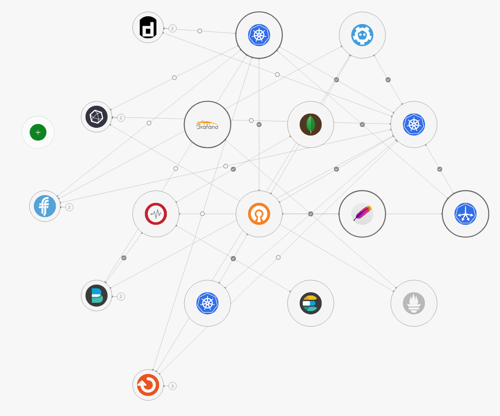
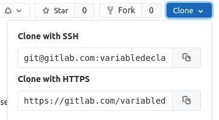

# Using GitLab as a container registry

## Introduction

The aim of this tutorial post is to demonstrate how you can use Charmed Kubernetes in a CI/CD environment using GitLab’s container registry functionality.

GitLab has the ability to store upto 10GB in a container registry for projects, you can incorporate the building of these containers into your own CI/CD pipeline or you can use Gitlab’s own CI/CD functionality to do this for you. For the purposes of this blog post you will do this by hand so you can get a grasp of the process.

## Before you start

Find yourself a healthy kubernetes cluster, or if you don’t have access to a cluster, head over to [MicroK8s](https://tutorials.ubuntu.com/tutorial/install-a-local-kubernetes-with-microk8s#0) and install one on your laptop at no cost to yourself, if you’re on Windows you can follow [this guide](https://itnext.io/microk8s-on-windows-the-canonical-way-ed15fd4e5476).



## Process
To create our container registry on gitlab you will need to complete the following steps:

- Create a project
- Add a Dockerfile
- Enable Container Registry
- Build our image
- Push our image
- Pull our image

## Choose or create a project

To begin with, you can use an existing project or create a new one, I will be creating a new project called gitlabregistries, for the purposes of experimentation, you will create a private project.


Grab the git repository address and clone the repository to a directory of your choice.



## Create the docker file

Firstly, get a terminal inside of the newly cloned directory:


To setup our shell project, you are going to do two things, create the dockerfile and add a small program to show that our image has deployed to Kubernetes.

Let's start with the program:

```
vi main.py
```

Add these lines to the new file:

```
import time


def main():
    while True:
       print("Ubuntu runs containers!")
       time.sleep(5)


 if __name__ == "__main__":
     main()

```
Now that is done you can move onto the Dockerfile:

```
vi Dockerfile
```

Add these lines:

```
FROM ubuntu:latest
RUN apt-get update && apt-get -y install python3
COPY ./ /opt/vb
CMD [“python3”, “/opt/vb/main.py”]
```

You can now build our container, but before this you need to enable container registries on Gitlab and grab the URL, here we have a screenshot of an already enabled projected, but you can find the settings to enable in **Settings > General > Visibility, project features, permissions** and press the expand button.


## Build our container

The command here to build can be copied and used in your terminal:
```
docker build -t registry.gitlab.com/<YOUR_USERNAME>/gitlabregistries .
```
Before you can push to the repository you need to login to docker:
```
docker login registry.gitlab.com -u <USERNAME>
```
You should see a message similar to this if the login was successful:


## Push our container

When can then push to our project’s repository:
```
docker push registry.gitlab.com/<YOUR_USERNAME>/gitlabregistries
```
## Pull our container

### Create a token

Before you can pull from the private repository a secret for Kubernetes needs to be created to allow pulling:


In this case I have used the username k8s, take note of the token, and following the [Kubernetes documentation](https://kubernetes.io/docs/tasks/configure-pod-container/pull-image-private-registry/#registry-secret-existing-credentials), you can create a new secret:

```
kubectl create secret docker-registry regcred --docker-server=registry.gitlab.com --docker-username=k8s --docker-password=<token>
```

Run kubectl get secret regcred just to check, mine looks like this:

```
apiVersion: v1
data:
  .dockerconfigjson: eyJhdXRocyI6eyJyZWdpc3RyeS5naXRsYWIuY29tIjp7InVzZXJuYW1lIjoiazhzIiwicGFzc3dvcmQiOiJ6enJQNk0zUEJkX0tuZE5INmt1cCIsImF1dGgiOiJhemh6T25wNmNsQTJUVE5RUW1SZlMyNWtUa2cyYTNWdyJ9fX0=
kind: Secret
metadata:
  creationTimestamp: "2019-08-30T13:55:11Z"
  name: regcred
  namespace: default
  resourceVersion: "19552"
  selfLink: /api/v1/namespaces/default/secrets/regcred
  uid: be61c809-1572-431f-8a73-43c80e934923
type: kubernetes.io/dockerconfigjson
```

Now you can create a deployment with our newly uploaded container image:

```
kubectl create deployment gitlabrepositories --image=registry.gitlab.com/<YOUR_USERNAME>/gitlabregistries
```

Now wait for it to come up:

```
watch kubectl get pods
```

Initially kubernetes will fail to pull the image, and you should see something like this:

```
gitlabrepositories-86d4b9bf87-q86rx   0/1     ImagePullBackOff    0          3m39s
```

This is because there's no secret, you need to edit the deployment:

```
kubectl edit deployment gitlabrepositories
```

Under the `containers` spec you need to add imagePullSecrets so that it looks something like this:
```
     spec:
       containers:
       - image: registry.gitlab.com/variabledeclared/gitlabregistries
         imagePullPolicy: Always
         name: gitlabregistries
         resources: {}
         terminationMessagePath: /dev/termination-log
         terminationMessagePolicy: File
       dnsPolicy: ClusterFirst
       imagePullSecrets:
       - name: regcred
```

Check the pods again, your container should now have started.


If your pod has started then lets check the logs for logging!

```
kubectl logs -f <YOUR_POD_NAME>
```

Hmm, there seems to be a problem:


I forgot something! But that’s fine because you have a (semi) automatic process setup now, let's go into the docker file and add this line just before CMD:

```
ENV PYTHONUNBUFFERED=0
```

Rebuild:

```
docker build -t registry.gitlab.com/<YOUR_USERNAME>/gitlabregistries:v1 .
```

Push:

```
docker push registry.gitlab.com/variabledeclared/gitlabregistries:v1
```

And update our deployment with the new image tag:
```
   spec:
       containers:
       - image: registry.gitlab.com/variabledeclared/gitlabregistries:v1
         imagePullPolicy: Always
         name: gitlabregistries
         resources: {}
         terminationMessagePath: /dev/termination-log
         terminationMessagePolicy: File
       dnsPolicy: ClusterFirst
       imagePullSecrets:
       - name: regcred
       restartPolicy: Always
       schedulerName: default-scheduler
       securityContext: {}
      terminationGracePeriodSeconds: 30
```
OK lets check the logs now:


Voila!

# Conclusion

In this blog post you learnt how to use Gitlab as a container repository, albeit with some human labour involved, you can checkout Gitlab’s [documentation](https://docs.gitlab.com/ee/ci/README.html) on how to take your newly learned skills and apply them to your own CI/CD or create one in gitlab.

If you don’t wish to use a private repository then you can use these steps as a guide, ignoring the generate token steps.
