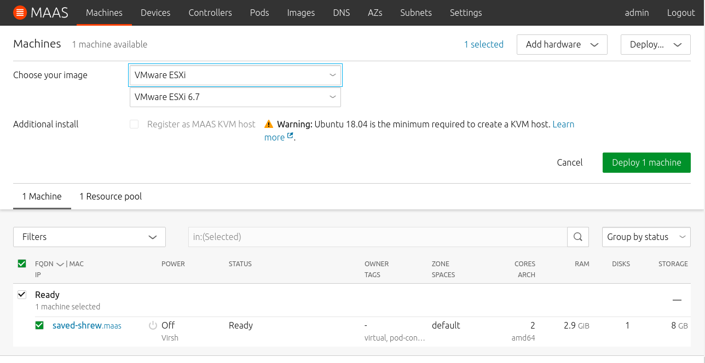

# Create and deploy ESXi with MAAS

## Overview
Duration: 0:05

In this tutorial, you will learn how to create MAAS images of ESXi using MAAS provided packer scripts.

ESXi support was first introduced in MAAS 2.5, but expanded in 2.6 allowing for the configuration of VMFS datastores, registration to vCenter and others. For more information about what features MAAS support, please refer to the following blog post <Provisioning ESXi with MAAS: An Overview> ..

In order to create ESXi images MAAS leverages the use of packer, and alongside the image creation process, it introduces a series of scripts and dependencies that makes it possible for MAAS to customize each ESXi deployment, including network configuration, datastore creation and user level customization.

### What you'll learn

* Create an ESXi image
* Upload an ESXi image to MAAS
* Deploy an ESXi image over the WebUI & API

### What you'll need

* Ubuntu Desktop 18.04 (To create images)
* Packer [Get it here](https://www.packer.io/downloads.html)
* VMWare ESXi ISO [Get it here](https://my.vmware.com/web/vmware/details?downloadGroup=ESXI650&productId=614)
* MAAS ESXi packer scripts [Get it here](https://maas.io/vmware-images)

## Getting started
Duration: 0:10

The first step is to create a working directory:

```bash
mkdir -p ~/maas-esxi
```

Then, move all the downloaded files (Packer, ESXi ISO and the MAAS ESXi scripts) to the working directory (In this example, we are moving them from ~/Downloads/):

```bash
mv ~/Downloads/VMware-VMvisor-Installer-6.7.0-8169922.x86_64.iso ~/maas-esxi
mv ~/Downloads/packer_1.4.2_linux_amd64.zip ~/maas-esxi
mv ~/Downloads/packer-maas-1.0.2.tar.xz ~/maas-esxi
cd ~/maas-esxi
```

Finally, unpack the ESXi MAAS packer scripts tarball:

```bash
tar xJvf packer-maas-1.0.2.tar.xz
```

## Creating your image
Duration: 0:03

To create the images, ensure you are in the right directory (This is the directory where these MAAS packer files are stored):

```bash
cd ~/maas-esxi/packer-maas-1.0.2/vmware-esxi/
```

Then load the `nbd` driver. This will allow the injection of specific MAAS files into the image:

```bash
sudo modprobe nbd
```

After loading the driver, the image creation can be started:

```bash
sudo packer build -var 'vmware_esxi_iso_path=~/maas-esxi/VMware-VMvisor-Installer-6.7.0-8169922.x86_64.iso' vmware-esxi.json
```

Please note that you can watch the image creation process by opening a VNC session on `127.0.0.1:5947`. The successfull completion of the image creation with result in the following output:

```bash
Warnings for build 'qemu':

* A checksum type of 'none' was specified. Since ISO files are so big,
a checksum is highly recommended.

==> qemu: Downloading or copying ISO
    qemu: Downloading or copying: file:///home/ubuntu/maas-esxi/VMware-VMvisor-Installer-6.7.0.update02-13006603.x86_64.iso
==> qemu: Creating hard drive...
==> qemu: Starting HTTP server on port 8911
==> qemu: Looking for available port between 5900 and 6000 on 127.0.0.1
==> qemu: Starting VM, booting from CD-ROM
    qemu: The VM will be run headless, without a GUI. If you want to
    qemu: view the screen of the VM, connect via VNC without a password to
    qemu: vnc://127.0.0.1:5914
==> qemu: Overriding defaults Qemu arguments with QemuArgs...
==> qemu: Waiting 3s for boot...
==> qemu: Connecting to VM via VNC
==> qemu: Typing the boot command over VNC...
==> qemu: Waiting for shutdown...
==> qemu: Running post-processor: shell-local
==> qemu (shell-local): Post processing with local shell script: /tmp/packer-shell536780074
    qemu (shell-local): /dev/nbd4 disconnected
    qemu (shell-local): /dev/nbd4 disconnected
==> qemu: Running post-processor: compress
==> qemu (compress): Using pgzip compression with 4 cores for vmware-esxi.dd.gz
==> qemu (compress): Archiving output-qemu/packer-qemu with pgzip
==> qemu (compress): Archive vmware-esxi.dd.gz completed
Build 'qemu' finished.

==> Builds finished. The artifacts of successful builds are:
--> qemu: VM files in directory: output-qemu
--> qemu: 
--> qemu: compressed artifacts in: vmware-esxi.dd.gz
```

The result of this is an image called `vmware-esxi.dd.gz`.

## Uploading your image
Duration: 0:02

To upload your image, first log-in to MAAS (192.168.122.1) via the CLI:

```bash
maas login admin http://192.168.122.1:5240/MAAS/
```

And upload the image with the following command:

```bash
maas admin boot-resources create name='esxi/6.7' title='VMware ESXi 6.7' architecture='amd64/generic' filetype='ddgz' content@=vmware-esxi.dd.gz
```

## Deploying your image
Duration: 0:02

Now that the image is available, we can go ahead and deploy a machine. In this example, we will use the machine with system_id 'yawrmb':

```bash
maas admin machine deploy yawrmb osystem=esxi distro_series=6.7
```

We can do the same in the Web UI:



## Next steps and finding help
Duration: 0:01

MAAS has been designed to be a modern, agile machine provisioning solution, enabling both physical and virtual infrastructure. MAAS can optimize the utilisation of existing small to medium scale IT infrastructure using VM pods. We have quickly transformed a single physical server into a lightweight, reliable virtual machine management node. The pod abstraction is very powerful and flexible, and if you need help as you are using it reach out to:

-   [MAAS discourse](https://discourse.maas.io)
-   [IRC-based support](https://wiki.ubuntu.com/IRC/ChannelList)

### Reference literature:

- [MAAS website](https://maas.io/)
- [Provisioning ESXi with MAAS: Quick start](https://ubuntu.com/blog/provisioning-esxi-with-maas)
- [MAAS ESXi documentation](https://maas.io/docs/vmware-images)
